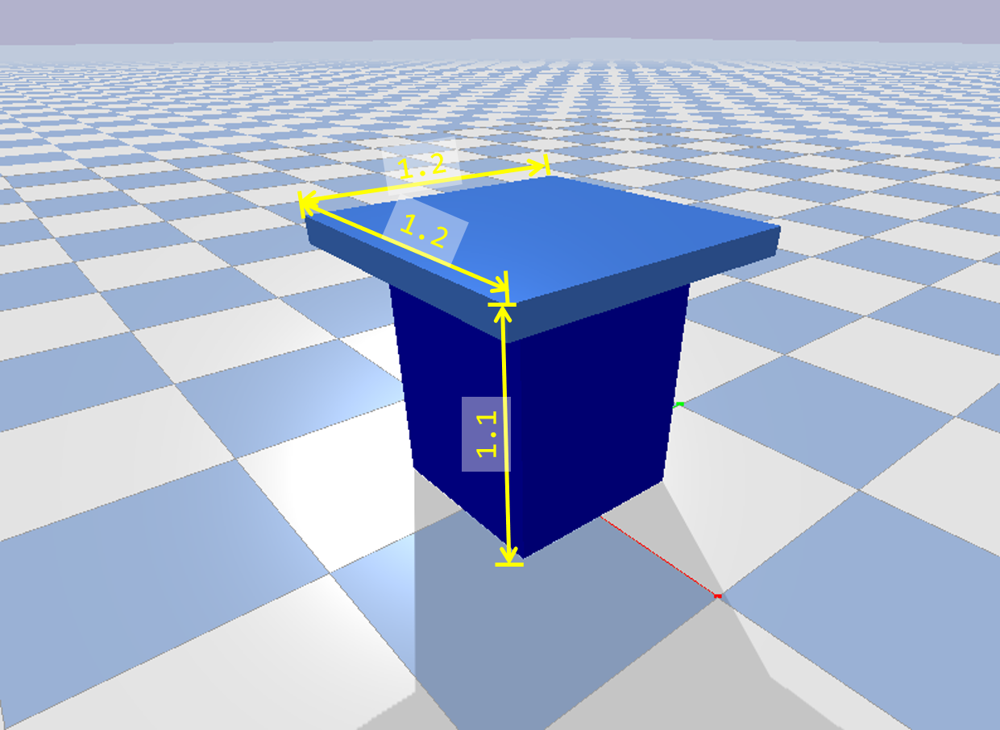

# Experiment #2 - Play Baseball

## Introduction

In this experiment, you are required to control the robot you built in Lab report #1. The robot is fixed on the table and you need to control the robot to grasp a baseball and throw it to a randomly given target position on the floor. You are required to plan a trajectory to catch the ball and throw it to the target, and then use inverse kinematics to solve the joint state on the trajectory, and eventually use the joint states to do position control for the robot.

## General Information

### Robot

The robot must be realistic. You can not design a robot with changable link length or other unrealistic properties.

### Integrity

You can only write your control algorithms and commands in the simulation code and only control the specific motors on your robot. The code should be submitted along with the report. Do not try any methods to get higher scores in a dishonest way.

### Scoring

Automatic scoring is used in this experiment. Functions for automatic scoring is embedded in the given script. You can run your code and the script locally on your own computer and see the score for your control algorithm, but the final score is the average score for the results from our server. 
If large difference appears between the score from the server and your local results, please contact the T.A. and we can recheck the results.

### Grading

The final grade of one experiment depend both on the absolute score and the relative rank.

## Details

### Environment

#### Table and baseball

The detailed size of the table is shown in the fig below (unit: m). The baseball is a sphere with a radius of 4 cm and a weight of 150g. The baseball is randomly placed in a limited square on the table. Once you throw a baseball to the ground, the robot arm will be reset to initial position and a new baseball will be put on the table randomly.

#### Robot

The base of robot should be fixed on the table at any position you like. The total length of your robot cannot be longer than 5 m. **Since the existence of prismatic joints will simplify this problem much, only continuous or revolute joints are allowed.** The base of the robot should be fixed on the table. A link with mass = 0 in urdf file means a fixed link in pybullet, but those link can not hold collision property. You have to create another link with mass and collision and attach it to the base with a fixed joint.

#### Targets

4 targets will be given randomly in order of distance. The position will be $P(i) = [r_i \cos\theta_i, r_i \sin\theta_i, 0]$ , where $r_i \sim U(i, i+1), \theta_i \sim U(-\pi/2, \pi/2), i=1,2,4,8$ .

### Code

The `rsc` folder contains URDF files. The `src` folder contains python script and you should modify the files in this folder, but you can also write other files and import them in the `main.py`. The `log` folder is used to contain score or other data from each experiment.

`Env.py` , `Helper.py` and `main.py` is used for basic setting for the task, do not modify them. `RobotControl.py` contains three functions that you can modify, but do not change the input and output for those function. The simulation is done with a timestep of 1/240 second.

`load` function is used for loading the robot and return your robotId in pybullet. 

`generateTraj` function is used to generate joint level trajectories. It takes three input: `robotId` is the UniqueBodyIndex for your robot arm, you can get states and informations about your robot arm with this variable. `ballPos` is the position for the baseball on the table in world coordinate. The data structure is a list of three float, like [x, y, z]. `targetPos` is the target position on the ground in world coordinate. The data structure is a list of three float, like [x, y, z]. The return variable `traj` should be a second order list like [[j_1(t1), j_2(t1), j_3(t1)], [j_1(t2), j_2(t2), j_3(t2)], [j_1(t3), j_2(t3), j_3(t3)], ...]. The first dimension is time steps and the second dimensional is the joint index. You should write your own code to plan the trajectory and solve the inverse kinematics. **Do not use the inverse kinematics sovler in pybullet!** The whole traj is generated before actual controlling the robot, real time planning or adjustment is not supported.

`addDebugItems` function is used to add visual debug items during simulation.

You can run the `main.py` to examine your algorithm. When every thing is done, please pack `proj2_baseball` folder and submit the code along with the report.

### Score

The distance from the target position to the position on the ground where the ball first drop is used for scoring, marked as `d`. When $d<0.1m$ , the score is 100. When $d>0.1m$, the score is $\frac{100\times0.1^{0.25}}{d^{0.25}}$ . The final socre is the average for four throw.

# 实验 #2 - 打棒球

## 简介

在本次实验中，你需要控制第一次实验中设计的机械臂。机械臂的底部固定在桌上，控制机械臂抓取桌面的棒球，并且扔向指定位置。你需要规划机械臂的运动路径，并且利用逆运动学求解运动轨迹上的关节位置，从而对机械臂进行运动控制。

## 一般信息

### 机器人

机器人必须符合实际。不能使用连杆长度无限可变的机器人，也不能设计其他不符合实际的机器人。

### 诚信

编程中只能编写必要的控制算法和控制命令，只能控制指定电机。程序源码需要和报告一起提交。不能为了分数篡改程序。

### 评分

实验提供的程序自带自动记分函数。本地调试时可以在本地进行评分，但是最终分数以交叉力学中心服务器多次运行的平均结果为准。如果服务器评分与本地评分存在较大差异，可以申请重新核对。

### 成绩

最终成绩是程序评分和排名的综合结果。

## 实验细节

### 任务环境

#### 桌子与棒球

桌子的尺寸如下图所示（单位：米），棒球半径4cm，质量150g，棒球会随机在桌面上生成。每当扔出的球落地，机械臂的位置就会被重置，并且在桌面上随机刷新一个新的球。

#### 机器人

机器人的底座可以被固定在桌面上的任何位置。机械臂的总长不能超过5m。 **由于滑动关节(prismatic joint)会极大简化问题，机械臂只能使用旋转关节。** URDF文件中0质量的连杆会被pybullet定义为固定连杆。由于0质量连杆不能定义碰撞，因此需要另外创建一个带碰撞的连杆，固定连接到0质量连杆上。

#### 目标位置

每次实验会随机给出四个目标位置，世界坐标系的位置为 $P(i) = [r_i \cos\theta_i, r_i \sin\theta_i, 0]$ , 其中 $r_i \sim U(i, i+1), \theta_i \sim U(-\pi/2, \pi/2), i=1,2,4,8$ .

### 代码细节

`rsc` 文件夹存储URDF文件。 `src` 保存python源代码，你需要在这个文件夹下编写程序, 并通过 `main.py`调用。 `log` 文件夹存储每次试验的数据。

`Env.py` , `Helper.py` 与 `main.py` 用做实验的基础设置与记分, 请不要修改。 `RobotControl.py` 包含三个主要的函数，你需要通过修改这三个函数完成实验任务, 但是请不要修改函数的输入与输出，也可以创建新的子函数，在这三个函数中调用。 实验所用的时间步长为1/240秒。

`load` 函数用于加载机械臂，返还机械臂在pybullet中的id。

`generateTraj` 函数用于生成关节位置轨迹。 函数有三个输入: `robotId` 是机械臂在pybullet中的id，用于获取机械臂的状态与信息。 `ballPos` 是棒球在世界坐标系中的初始位置，为[x, y, z]形式的python列表。 `targetPos` 是世界坐标系中目标位置的坐标，为[x, y, z]形式的python列表。返还值 `traj` 需要为二阶列表，形如 [[j_1(t1), j_2(t1), j_3(t1)], [j_1(t2), j_2(t2), j_3(t2)], [j_1(t3), j_2(t3), j_3(t3)], ...]。第一个维度为时间步，第二个维度为关节。需要通过编程规划运动轨迹，并且通过逆运动学求解运动轨迹上的关节位置。 **请勿使用pybullet的逆运动学求解器！** 轨迹需要根据位置事先生成，不能实时调整。

`addDebugItems` 函数用于添加可视化的调试信息。

通过运行 `main.py` 测试算法并且进行评分。提交报告时，请将`proj2_baseball`文件夹打包同时提交。

### 评分

本实验根据棒球落点到目标位置的水平距离打分，记距离为 `d`. 当 $d<0.1m$ 时，当次投掷的得分为100； 当 $d>0.1m$ 时, 当次投掷的得分为 $\frac{100\times0.1^{0.25}}{d^{0.25}}$ 。最终的总分是四次投掷的平均分。