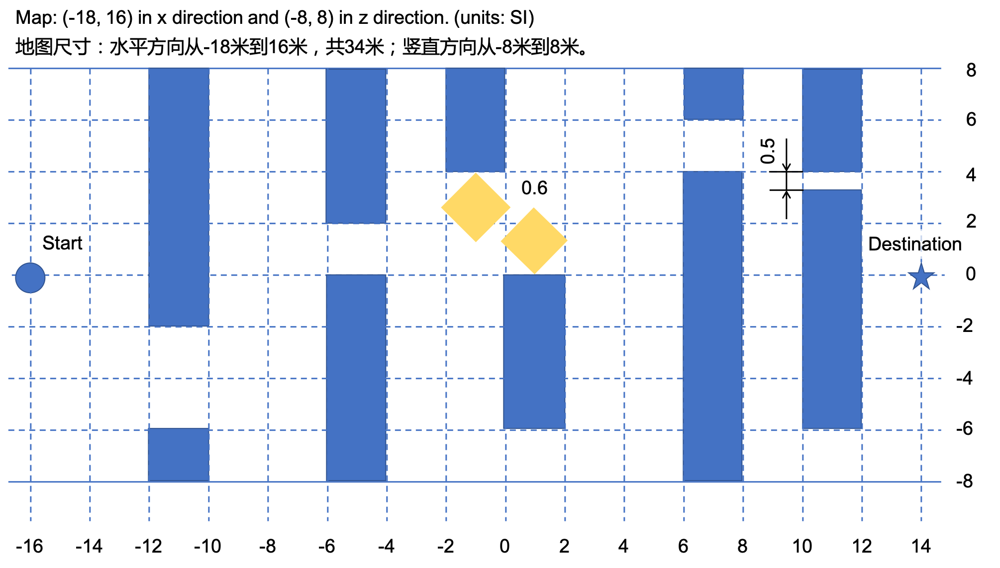
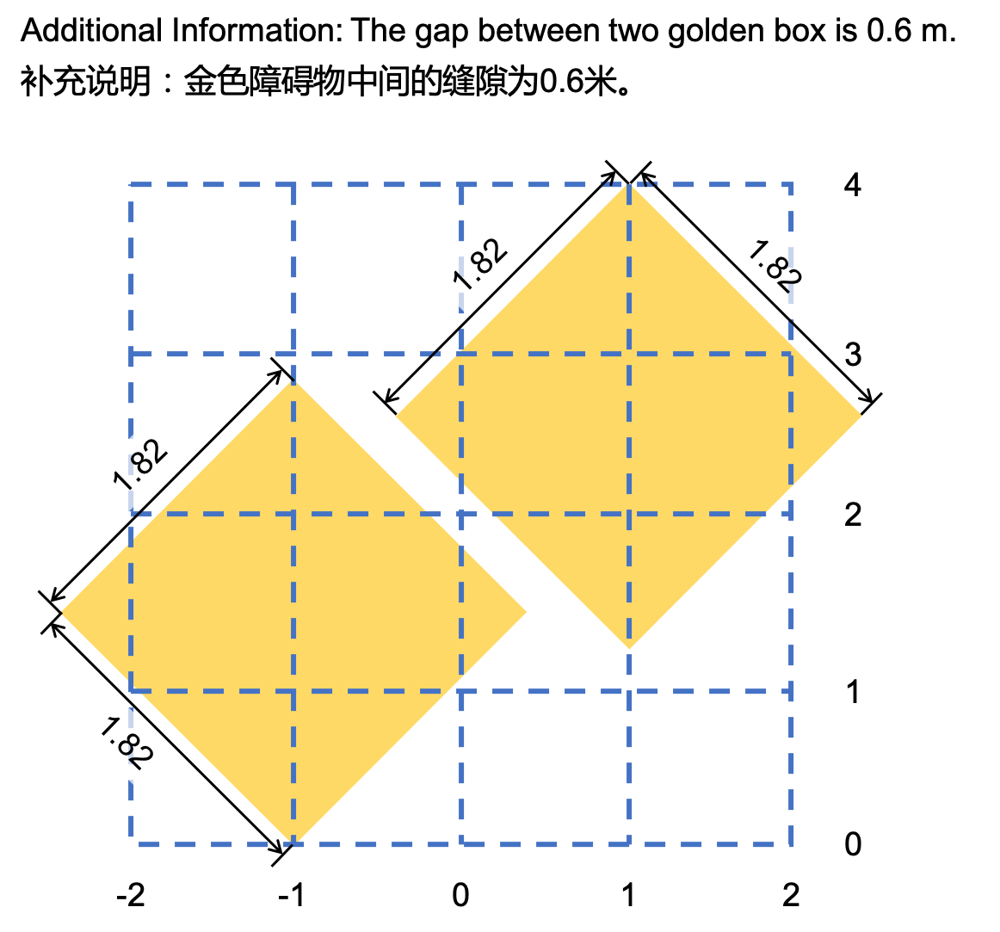
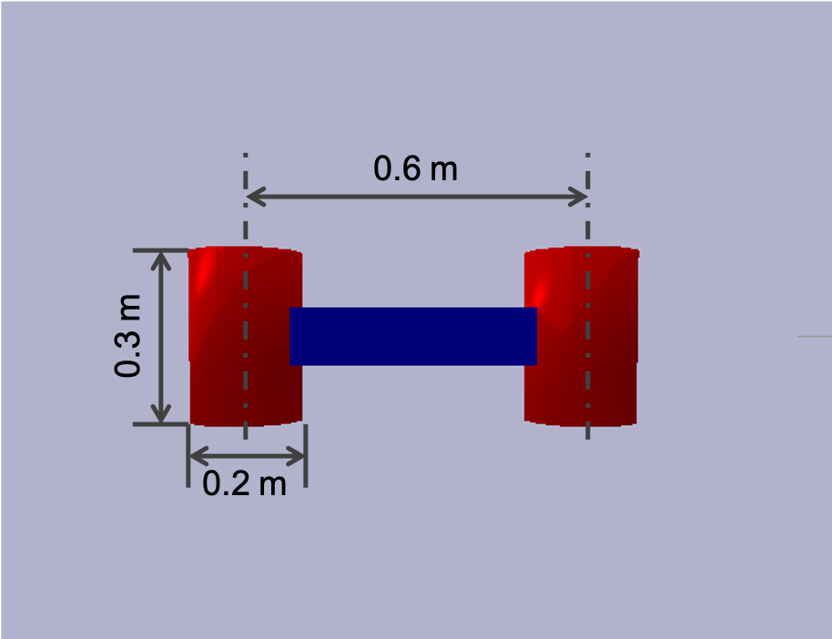

# Experiment #3 - Fly! Fly! Fly!

## Introduction

In this experiment, you are requiered to control a UAV to cross a forest in a 2 dimensional plane. The UAV is subjected to random distributions. Thus you need automatic real time adjustment to make sure your UAV flies as you desired.

## General Information

### Integrity

You can only write your control algorithms and commands in the simulation code and only control the specific motors on your robot. The code should be submitted along with the report. Do not try any methods to get higher scores in a dishonest way.

### Scoring

Automatic scoring is used in this experiment. Functions for automatic scoring is embedded in the given script. You can run your code and the script locally on your own computer and see the score for your control algorithm, but the final score is the average score for the results from our server. 

If large difference appears between the score from the server and your local results, please contact the T.A. and we can recheck the results.

### Grading

The final grade of one experiment depend both on the absolute score and the relative rank.

## Details

### Environment

#### Dimension

This experiment is taken in a 2 dimensional plane. Thus the robot only have three degree of freedom: translation along x and z direction and rotation along y direction. The gravity is in -z direction.

#### Map

The map of the forest is given in a urdf file. The UAV starts from one side of the map and needs to reach the other side. A detailed illustration is given in the below figures. There are many possible ways to the destination, you should choose one that best suit for your control algorithm.

#### Robot

The robot is given in a urdf file. Special treatments are taken to constraints the UAV into a 2 dimensional world. The base for the robot is a fixed base with zero mass. The real base of the robot is constraints to the fixed "world base" via two virtual links with three joints, that is, two prismatic joint for translation and one continuous joint for rotation. The mass and inertia of those virtual links can be ignored.

The exact size for the UAV with full collision is given in the figure below. The UAV has two sphere engines, one for each side. The engines can provide limited and noised force along the axes of symmetry.

The base of the UAV has a weight of 8 kg and a moment of inertia of 0.3 kg m^2 around the center of mass. Each engine has a weight of 1 kg and a moment of inertia of 0.1 kg m^2 around its own center of mass. Details can be found in the urdf file.

#### Control

The control is implemented by applying external force on the engines in their local frames. The output force contains a uniform distributed noise of 3%. The limitation of output force is 100 N for each engine. When the signal reaches over 100, the output will be 100 N with a uniform distributed noise of 6 N. (double noise for extreme conditions)

### Code

The `rsc` folder contains URDF files. The `src` folder contains python script and you should modify the files in this folder, but you can also write other files and import them. The `log` folder is used to contain score or other data from each experiment.

`Env.py` , `Helper.py` and `main.py` is used for basic setting for the task, do not modify them. `MapGenerator.py` is used to generate the urdf file for the map, it is no longer needed once you can find `forest.urdf` in `rsc` folder. `RobotControl.py` contains three functions that you can modify, but do not change the input and output for those function unless mentioned. The simulation is done with a timestep of 1/240 second.

`generateTraj()` function is called before actual control and returns a variable `plan`. This can be in any data sturcture you like. `realTimeControl()` takes the `robotId` and `plan` (just the one you get from `generateTraj()`) as input, and return a list of two float, representing the control singal for two engine. You can get the state for the robot and compare the current state to planned trajectory, and final calculate the control signal. Thus, you should make good use of the `plan` variable since it is prior information you can visit in real time control. `addDebugItems()` can be used for adding debug items. The input and output of this function can be modified as you need.

Eventually, you can run `main.py` to examine your control algorithm. In `main.py`, the control is performed in a loop. When the UAV finally contact with the final position, the loop breaks. Your have to create a `log` folder in the project folder (the folder in which you find this README) to ensure the logging functions.

### Score

The score depends on the total simulation time (number of time steps multiply timestep) and whether your UAV reaches the destination. Please submit at least one video and three text file recording your results along with your report.

# 实验 #3 无人机穿越

## 简介

本次实验中，你需要在二维平面内控制无人机穿越一片森林。无人机在飞行过程中会受到随机扰动，需要通过自动的实时控制使无人机按照设定飞行。

## 一般信息

### 诚信

编程中只能编写必要的控制算法和控制指令，只能控制制定电机。程序源码需要和报告一起提交。不能为了分数篡改程序。

### 评分

实验提供的程序自带自动记分函数。本地调试时可以在本地进行评分，但是最终分数以交叉力学中心服 务器多次运行的平均结果为准。如果服务器评分与本地评分存在较大差异，可以申请重新核对。

### 成绩

最终成绩是程序评分和排名的综合结果。

## 实验细节

### 任务环境

#### 维度

本实验在二维平面上进行，机器人包含x,z轴平动自由度和绕y轴转动自由度。重力沿z轴负方向。

#### 地图

本实验地图在urdf文件中给定。无人机需要从地图一侧飞到地图另一侧，地图细节可查看下图。

#### 机器人

机器人的urdf文件给定。为了在三维物理引擎中模拟平面动力学问题，在机器人的urdf文件中做了特殊的处理。urdf文件中的第一个杆是一个无体积的固定杆，无人机的机身通过三个铰与固定杆相连，分别是两个平动铰和一个转动铰。无人机机身到固定连杆之间的虚拟连杆质量和转动惯量均忽略笔记。

无人机的尺寸如下如所示，无人机两侧各有一个圆柱形的引擎，引擎能在对称轴方向提供有限且有扰动的推力。

无人机的机身为8kg，绕质心转动惯量0.3 kg m^2。每个引擎质量为1kg，面内绕质心转动惯量为0.1 kg m^2。细节详见urdf文件。

#### 控制

引擎的控制通过在引擎局部坐标系下施加外力实现。输出力包含3%均匀分布的噪音。输出力的最大幅值为100N，当输入信号超过100N时，按照100N输出，并且带有6%的随机误差。

### 代码细节

`rsc` 文件夹存储URDF文件。 `src` 保存python源代码，你需要在这个文件夹下编写程序并调用。 `log` 文件夹存储每次试验的数据。

`Env.py` , `Helper.py` 和 `main.py` 用做实验的基础设置与记分, 请不要修改。`MapGenerator.py` 用于生成地图的urdf文件，如果能在 `rsc` 文件夹中找到 `forest.urdf` ，就不需要运行这个程序。 `RobotControl.py` 包含了你需要编写的函数，如果没有特殊说明，请不要修改函数的输入和输出。实验所用的时间步长为1/240秒。

`generateTraj()` 函数在实际控制前运行，并且返还一个变量，名为 `plan`，该变量可以使用任意数据类型。 `realTimeControl()` 的输入是 `robotId` 和 `plan` (即 `generateTraj()` 的返还值)，并返还一个包含两个浮点数的列表，两个数分别是两个引擎的输入信号。使用 `robotId` 可以获取机器人的当前状态，与 `plan` 中的数据相对比，以此为依据计算机器人实时控制量。可以使用 `addDebugItems()` 函数添加调试信息。

运行 `main.py` 测试编写的算法。在 `main.py`, 程序通过循环体控制动力学仿真，当机器人到达目标位置时，退出循环。请手动在当前目录（即本文档所在目录）下建立 `log` 文件夹，以保证记录功能正常运行。

### 评分

最终成绩同时取决于模拟时长（即模拟步数与时间步长的乘积）与无人机到达目标与否。提交报告时，请同时提交一个实验视频与三次耗时记录。