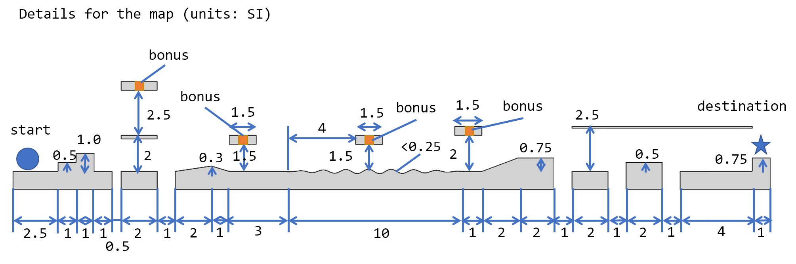

# Experiment #4 - Run! Run! Run!

## Introduction

In this experiment, you are requiered design a robot with two engines and design your control algorithm.
The robot need to has the capabilities to run and jump on rough ground following a planned trajectory to cross a complex terrian ~~and rescue the princess~~.

## General Information

### Robot

The robot must be realistic. You can not design a robot with changable link length or other unrealistic properties. You should place your center of mass on reasonable positions.

### Integrity

You can only write your control algorithms and commands in the simulation code and only control the specific motors on your robot. The code should be submitted along with the report. Do not try any methods to get higher scores in a dishonest way.

### Scoring

Automatic scoring is used in this experiment. Functions for automatic scoring is embedded in the given script. You can run your code and the script locally on your own computer and see the score for your control algorithm, but the final score is the average score for the results from our server. 

If large difference appears between the score from the server and your local results, please contact the T.A. and we can recheck the results.

### Grading

The final grade of one experiment depend both on the absolute score and the relative rank.

### Bug report

The code and the resources are not fully tested for various conditions. Please contact the TA whenever you find anything wrong.

## Details

### Environment

#### Dimension

This experiment is taken in a 2 dimensional plane. Thus the robot only have three degree of freedom: translation along x and z direction and rotation along y direction. The gravity is in -z direction.

#### Map

The map is given in a urdf file. The robot starts from one side of the map and needs to reach the other side. A detailed illustration is given in the figure and slide below. There are many possible ways to the destination, you should choose one that best suit your control algorithm.
Due to the physics engine, the collision between robot and the map is not as accurate as analytical solution, excatly for concave structures. The difference is not significant, but your control algorithm should be robust.

#### Bonus

Like the game of Super Mario, you can get bonus by jumping to contact special blocks. In this experiment, four special blocks are given and you can get a bonus of reducing your total time cost by 5 s for each block. You can decide whether to get the bonus or not depending on your control algorithm and your game policy.

#### Robot

You are required to design your own robot. Special treatments are needed to constraints the robot into a 2 dimensional world. The base for the robot is a fixed base with zero mass. The real base of the robot is constraints to the fixed "world base" via two virtual links with three joints, that is, two prismatic joint for translation and one continuous joint for rotation. The mass and inertia of those virtual links can be ignored.

Two engines should be continuous joints named "engine1" and "engine2", which is used in the code to find the jointID for engines.

Detailed limitation for your design are listed below (units: SI):

1. The minimum mass for each link is 0.5, and the minimum moment of inertia around y axis  is 0.1, except those virtual links or additional links for visualization only.

2. The minimum total mass is 8.

3. The max height for the robot is 1.5.

4. The max radius for the wheel is 0.1.

5. The mass of wheel is 1 and moment of inertia around y axis is 0.1.

6. The max velocity of engines are 30.

#### Control

The control is implemented by built-in torque control in pybullet. The output force contains a uniform distributed noise of 3%. The limitation of output force is 100 N for each engine. When the signal reaches over 100, the output will be 100 N with a uniform distributed noise of 6 N. (double noise for extreme conditions)

### Code

The `rsc` folder contains URDF files. The `src` folder contains python script and you should modify the files in this folder, but you can also write other files and import them. The `log` folder is used to contain score or other data from each experiment.

`Env.py` , `Helper.py` and `main.py` is used for basic setting for the task, do not modify them. `RobotControl.py` contains four functions that you can modify, but do not change the input and output for those function unless mentioned. The simulation is done with a timestep of 1/240 second.

`loadRobot()` is used to load your robot and returns a unique id for the robot in pybullet.
`generateTraj()` function is called before actual control and returns a variable `plan`. This can be in any data sturcture you like. You can even make your plan as a list or a class and put everything you want into it.
`realTimeControl()` takes the `robotId` and `plan` (just the one you get from `generateTraj()`) as input, and return a list of two float, representing the control singal for two engine. 
You can get the state for the robot and compare the current state to planned trajectory, and final calculate the control signal. 
Thus, you should make good use of the `plan` variable since it is prior information you can visit in real time control. 
`addDebugItems()` can be used for adding debug items. The input and output of this function can be modified as you need.

Eventually, you can run `main.py` to examine your control algorithm. In `main.py`, the control is performed in a loop. When the robot finally contact with the final position, the loop breaks. Your have to create a `log` folder in the project folder (the folder in which you find this README) to ensure the logging functions.

### Score

The score depends on the total simulation time (number of time steps multiply timestep), the bonus you get and whether your robot reaches the destination. Please submit at least one video and three text file recording your results along with your report.

# 实验 #4 超级马里奥：罗伯特

## 简介

本次实验中，你需要设计以个包含两个电机的机器人，并编写控制算法。机器人需要在粗糙地面上前进与跳跃，根据设计好的路线穿越一片复杂的地形~~并且拯救公主~~。

## 一般信息

### 机器人

机器人必须符合实际。不能使用连杆长度无限可变的机器人，也不能设计其他不符合实际的机器人。各个连杆的质心必须处于合理的位置。

### 诚信

编程中只能编写必要的控制算法和控制指令，只能控制制定电机。程序源码需要和报告一起提交。不能为了分数篡改程序。

### 评分

实验提供的程序自带自动记分函数。本地调试时可以在本地进行评分，但是最终分数以交叉力学中心服 务器多次运行的平均结果为准。如果服务器评分与本地评分存在较大差异，可以申请重新核对。

### 成绩

最终成绩是程序评分和排名的综合结果。

### 错误报告

本实验的程序与素材并未对种种可能的情况做充分的测试，如果发现任何问题请联系助教。

## 实验细节

### 任务环境

#### 维度

本实验在二维平面上进行，机器人包含x,z轴平动自由度和绕y轴转动自由度。重力沿z轴负方向。

#### 地图

本实验地图在urdf文件中给定。机器人需要从地图一侧出发前往终点。地图细节在下方给出。

由于物理引擎对于碰撞的求解并不如解析解精确，尤其是对于凹的结构。虽然这方面引起的偏差很小，但是设计控制算法时需要考虑这个问题。

#### 奖励

正如超级马里奥的游戏，本次实验中也可以通过跳跃，碰撞特殊的砖块获得奖励。本实验共四个特殊砖块，每个砖块可以得到一个奖励，内容为总时间减少5s。请根据控制算法和游戏策略选择是否需要这些奖励。

#### 机器人

机器人的urdf文件给定。为了在三维物理引擎中模拟平面动力学问题，在机器人的urdf文件中做了特殊的处理。urdf文件中的第一个杆是一个无体积的固定杆，无人机的机身通过三个铰与固定杆相连，分别是两个平动铰和一个转动铰。无人机机身到固定连杆之间的虚拟连杆质量和转动惯量均忽略笔记。

urdf文件中，电机所在joint的名称必须是"engine1"与"engine2"，因为程序中通过名称寻找这两个joint。

机器人的设计必须符合如下要求（国际单位制）：

1. 每个link的最小质量为0.5，最小y轴转动惯量为0.1。仅用于连接或者可视化的虚拟连杆不计。

2. 机器人的总重不少于8

3. 机器人最大高度不超过1.5

4. 每个轮子的最大半径为0.1

5. 轮子质量为1，y轴转动惯量为0.1.

6. 每个电机的最大转速为30.

#### 控制

控制通过pybullet内置的力矩控制实现。输出力包含3%均匀分布的噪音。输出力的最大幅值为100N，当输入信号超过100N时，按照100N输出，并且带有6%的随机误差。

### 代码细节

`rsc` 文件夹存储URDF文件。 `src` 保存python源代码，你需要在这个文件夹下编写程序并调用。 `log` 文件夹存储每次试验的数据。

`Env.py` , `Helper.py` 和 `main.py` 用做实验的基础设置与记分, 请不要修改。 `RobotControl.py` 包含了你需要编写的函数，如果没有特殊说明，请不要修改函数的输入和输出。实验所用的时间步长为1/240秒。

`loadRobot()` 用于加载设计的机器人并返还pybullet中的unique body id。
`generateTraj()` 函数在实际控制前运行，并且返还一个变量，名为 `plan`，该变量可以使用任意数据类型。可以将 `plan` 设计成一个列表或者一个类，存储所有需要的数据。 `realTimeControl()` 的输入是 `robotId` 和 `plan` (即 `generateTraj()` 的返还值)，并返还一个包含两个浮点数的列表，两个数分别是两个引擎的输入信号。使用 `robotId` 可以获取机器人的当前状态，与 `plan` 中的数据相对比，以此为依据计算机器人实时控制量。可以使用 `addDebugItems()` 函数添加调试信息。

运行 `main.py` 测试编写的算法。在 `main.py`, 程序通过循环体控制动力学仿真，当机器人到达目标位置时，退出循环。请手动在当前目录（即本文档所在目录）下建立 `log` 文件夹，以保证记录功能正常运行。

### 评分

最终成绩同时取决于模拟时长（即模拟步数与时间步长的乘积）、所获得的奖励以及机器人到达目标与否。提交报告时，请同时提交一个实验视频与三次耗时记录。